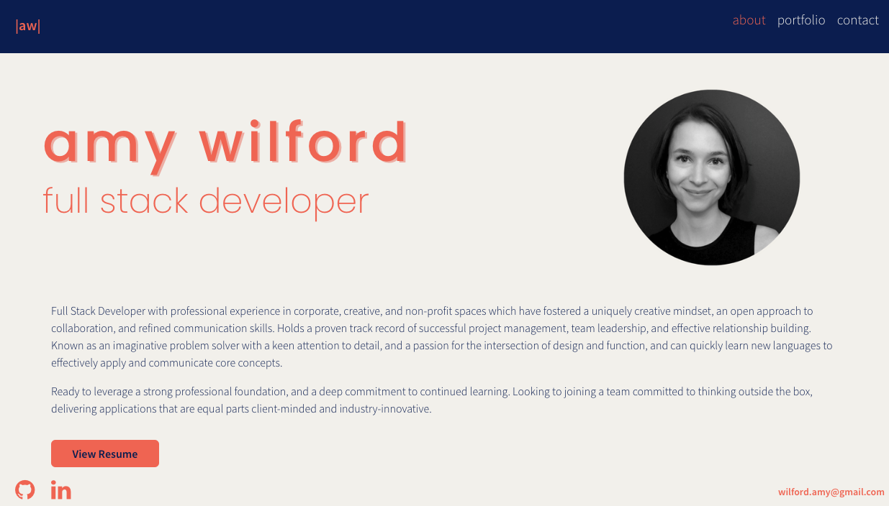

# Portfolio | Amy Wilford - Full Stack Web Developer

 

## Table of contents

- [Description](#Description)
- [Technologies](#Technologies)
- [Usage-Installation](#Usage-Installation)
- [Demo](#Demo)

## Description
My personal portfolio featuring a selection of my deployed projects, featuring front-end and fullstack work to showcase the reach of my collected skills. If you'd like to learn more about me and see what I can do - a copy of my resume is available on the deployed site, as well as my contact details.

## Technologies

This project was built using:

- React.js & JSX
- Node.js
- JavaScript
- Bootstrap
- CSS

## Usage-Installation

Open the deployed site (linked below).
If you wanted to download a local copy of this code you will need to install npm dependencies. In your terminal, run

```
npm i
```

Once installed, to launch the application locally, run:

```
npm start
```

## Demo

[Visit my portofilo](#https://amywilford.github.io/aw-developer-portfolio/)

\*Image of launched site at head of README
